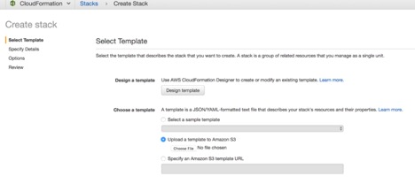
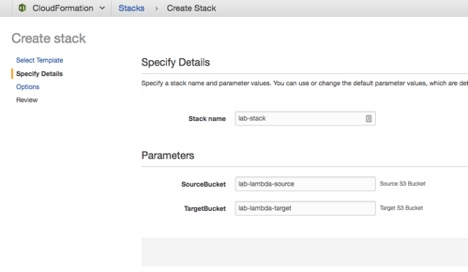

# CloudFormation To Provision Lab Resources

#### OVERVIEW
Use AWS CloudFormation to provision AWS services that are needed to kick start the lab exercises. The cloudformation stack will create the resources automatically which you were trying to create manually during the lab exercise.

#### GOALS
Build CloudFormation template to provision,
1.	Two S3 Buckets in user selected Region.
2.	IAM Role that has access to S3 Buckets, CloudWatch Logs, CloudWatch Event, assume role for Lambda function.
3.	Lambda function that copies objects from Source S3 bucket to Target S3 bucket.
4.	CloudWatch Event that triggers Lambda function.

#### Prerequisites
* Access to Amazon AWS Console (your AWS account)
* Permission to: S3, IAM, Cloudwatch, Lambda
* Install AWS CLI (optional)

	- Note: running this CloudFormation template may incur costs for the resources that are provisioned.

#### Steps to provision AWS resources
* Login to AWS Console with your AWS credentials.
* Select  Services -> CloudFormation 
* Download the template (lab1-sam-stack-template.json) file from [github link](https://github.com/ravindravilla/lab-aws-cloudformation/blob/master/lab1-sam-stack-template.json) on to your local computer.
* Click on Create Stack
* Choose Upload a template to Amazon S3, Choose File button to upload the file you downloaded.

* Click Next to navigate to Specify Details page. Enter lab-stack in the name field. Enter Source and Bucket names. Please note, the bucket names should be unique.

 
	- Note: Please ensure to enter a unique bucket name, as duplicate bucket name across AWS is not allowed. It is suggested to add your name or some personal  keyword at the end of the bucket name. Remember, not to add any capital letter or special character in the bucket name.
* Click Next to navigate to Options page, you may leave all the defaults and click Next
* In Review page, select checkbox "I acknowledge that AWS CloudFormation might create IAM resources with custom names". click Create to start creating the stack.

* You should see lab-stack in the list. Select lab-stack checkbox, click refresh to see the progress. Wait for CloudFormation to create the resources, you should see CREATE_COMPLETE status.

	- Note: Once the CloudFormation stack creation is complete, you will be absolutely ready to test the task:1. You can directly move to step: 7 to test task:1. 

Once the testing of task:1 is complete, please follow the steps for task:2 and task:3. For task:3, follow the step:1 and then directly move on to step: 27 as the API will already be created for you.

After completion of the tasks you can delete the CloudFormation stack. Before deleting the CloudFormation stack, please empty both the source and destination buckets. On deleting the CloudFormation stack, all resources (S3 buckets, CloudWatch event, Lambda function will get deleted automatically.